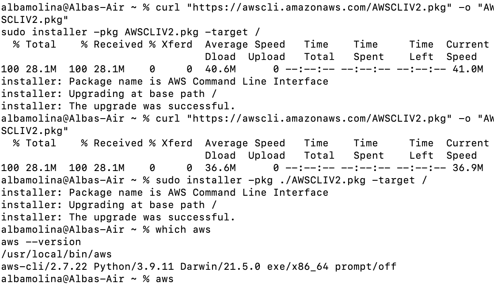
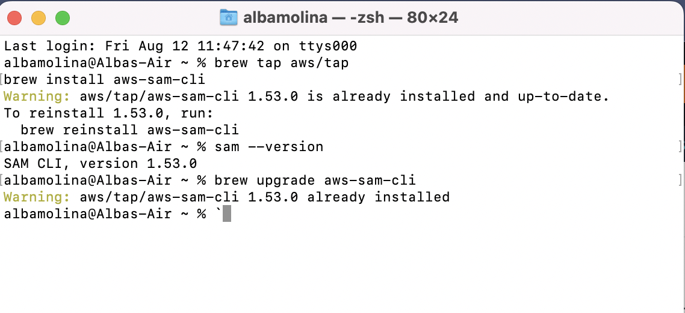

# AWS SAM CLI

## Instructions/ Setup

### Download AWS CLI

[download AWS CLI](https://docs.aws.amazon.com/cli/latest/userguide/getting-started-install.html)



### Setting up AWS Configurations


### Install Docker

[download Docker](https://docs.docker.com/desktop/install/mac-install/)


### Install AWS SAM CLI

AWS Serverless Application Model (different from serverless framework - it is a diff paradigm but the same idea)

[Install AWS SAM CLI](https://docs.aws.amazon.com/serverless-application-model/latest/developerguide/serverless-sam-cli-install-mac.html)



---

## What is AWS

1. What is SAM
2. Benefits of SAM
3. Create First SAM Project
4. Run Locally and Test it
5. Deploy to AWS Cloud

SAM used to define serverless app, uses the same concept as yamp but differences in how the structure of the application is put together. But essentially it is just a `different` way of creating a serverless application

AWS Components:

- `AWS SAM Template Specifications` - where you write properties to a file (just like serverless.yml all the metadata needed for the lambda functions to work) to describe functions, APIs, permissions, timeouts etc.
- `AWS SAM CLI` - invoke packages, deploy, view, run the applications locally, and test them
  
Benefits:

- `single deployment configuration` - AKA deply the whole stack as a single entity. It all comes packaged together when pushed to the cloud or run locally
- `Extention of AWS CloudFormation` - connection with how it is all packaged up, using what AWS cloud already has, not re-inventing the wheel
- Built in best practices as code reviews
- `Local debugging and testing via (docker)` before push to AWS cloud
- `Deep integration` with development tools

---

## Building a Basic SAM Hello World App

- use AWS CLI and SAM CLI to create a serverless project
- Run, test it locally
- Deploy to AWS Cloud
- Create same app using AWS Toolkit
- Run it, test it locally
- Deploy it to AWS Cloud and test it there too

### What the App will do

creating a simple API using `API Gateway` for the endpoint and `AWS Lambda Function`

- so when send `GET` request to `API Gateway endpoint`, the `Lambda function` is invoked, and then the lambda function will `return` a message

```-zsh
Last login: Fri Aug 12 11:56:04 on ttys001
albamolina@Albas-Air ~ % sam init

 SAM CLI now collects telemetry to better understand customer needs.

 You can OPT OUT and disable telemetry collection by setting the
 environment variable SAM_CLI_TELEMETRY=0 in your shell.
 Thanks for your help!

 Learn More: https://docs.aws.amazon.com/serverless-application-model/latest/developerguide/serverless-sam-telemetry.html


You can preselect a particular runtime or package type when using the `sam init` experience.
Call `sam init --help` to learn more.

Which template source would you like to use?
 1 - AWS Quick Start Templates
 2 - Custom Template Location
Choice: 1

Choose an AWS Quick Start application template
 1 - Hello World Example
 2 - Multi-step workflow
 3 - Serverless API
 4 - Scheduled task
 5 - Standalone function
 6 - Data processing
 7 - Infrastructure event management
 8 - Machine Learning
Template: 1

Use the most popular runtime and package type? (Python and zip) [y/N]: y

Would you like to enable X-Ray tracing on the function(s) in your application?  [y/N]: y
X-Ray will incur an additional cost. View https://aws.amazon.com/xray/pricing/ for more details

Project name [sam-app]: sam-app

Cloning from https://github.com/aws/aws-sam-cli-app-templates (process may take a moment)

    -----------------------
    Generating application:
    -----------------------
    Name: sam-app
    Runtime: python3.9
    Architectures: x86_64
    Dependency Manager: pip
    Application Template: hello-world
    Output Directory: .
    
    Next steps can be found in the README file at ./sam-app/README.md
        

    Commands you can use next
    =========================
    [*] Create pipeline: cd sam-app && sam pipeline init --bootstrap
    [*] Validate SAM template: sam validate
    [*] Test Function in the Cloud: sam sync --stack-name {stack-name} --watch
    
albamolina@Albas-Air ~ % ls
sam-app
albamolina@Albas-Air ~ % cd sam-app 
albamolina@Albas-Air sam-app % ls
README.md __init__.py events  hello_world template.yaml tests
albamolina@Albas-Air sam-app % code .
albamolina@Albas-Air sam-app % 
```

Note: [sam-app](sam-app/hello_world/app.py)  && [template.yml](sam-app/template.yaml) it is the `same` as what I already did with serverless
